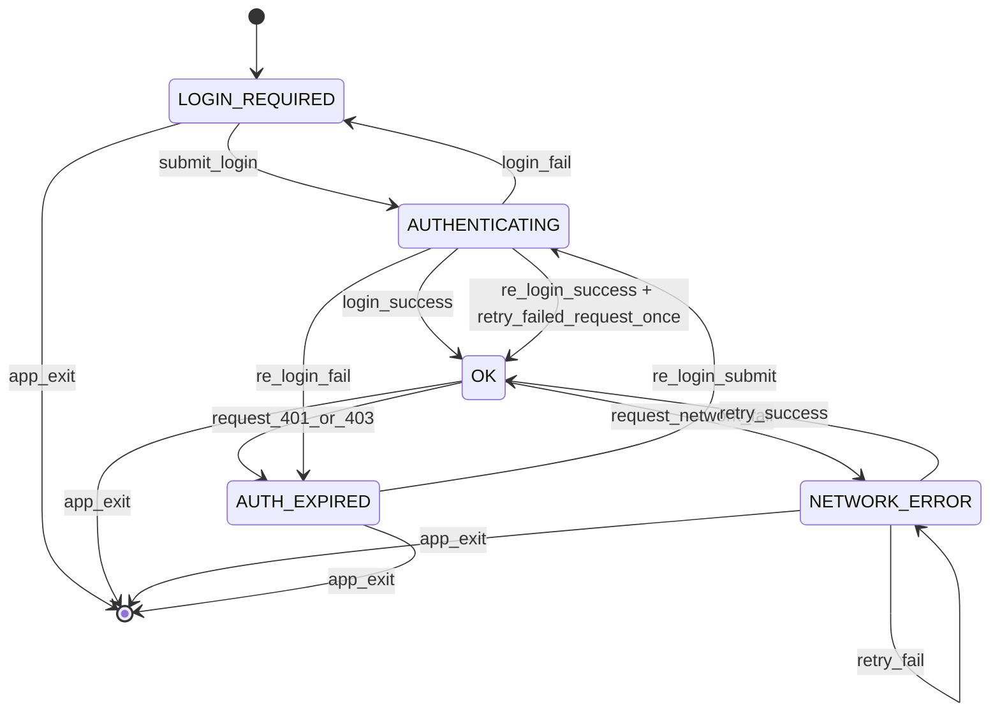
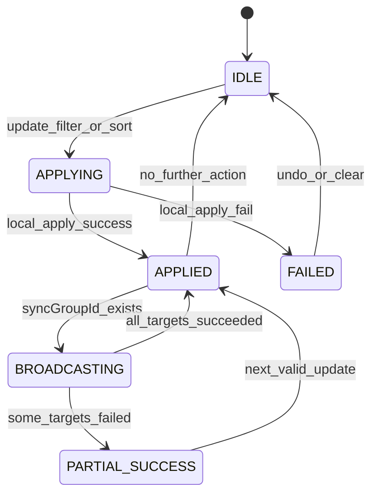

# Multi PocketBase UI - 타입/상태 전이 계약

`docs/ui-spec.md`의 확정 정책을 코드로 옮기기 위한 기준 문서다.
문서 우선순위 판단은 `docs/docs-index.md`를 따른다.

## 1) TypeScript 인터페이스

```ts
export type UnixMs = number;

export type InstanceStatus =
  | "ok"
  | "network_error"
  | "auth_expired"
  | "login_required";

export interface InstanceConfig {
  id: string;
  alias: string;
  baseUrl: string;
  updatedAt: UnixMs;
}

export interface AdminUser {
  id: string;
  email: string;
}

// Non-persistent runtime auth state
export interface AuthSession {
  instanceId: string;
  token: string;
  adminUser: AdminUser;
  updatedAt: UnixMs;
}

export interface InstanceRuntimeState {
  status: InstanceStatus;
  authSession: AuthSession | null;
  lastErrorMessage: string | null;
}

export interface TableViewPreset {
  id: string;
  name: string;
  instanceId: string;
  collectionName: string;
  visibleColumns: string[];
  columnOrder: string[];
  pinnedColumns: string[];
  filterQuery: string;
  sortSpec: string;
  pageSize: number;
  updatedAt: UnixMs;
}

export interface PanelTableState {
  instanceId: string;
  collectionName: string;
  visibleColumns: string[];
  columnOrder: string[];
  pinnedColumns: string[];
  filterQuery: string;
  sortSpec: string;
  page: number;
  pageSize: number;
  selectedRecordId: string | null;
  syncGroupId: string | null;
  appliedAt: UnixMs;
}

export type LayoutTreeNode = SplitNode | LeafNode;

export interface SplitNode {
  type: "split";
  dir: "horizontal" | "vertical";
  ratio: number;
  a: LayoutTreeNode;
  b: LayoutTreeNode;
}

export interface LeafNode {
  type: "leaf";
  groupId: string;
}

export interface WorkspaceTab {
  tabId: string;
  panelState: PanelTableState;
}

export interface WorkspaceGroup {
  activeTabId: string;
  tabs: WorkspaceTab[];
}

export interface WorkspacePreset {
  id: string;
  name: string;
  layoutTree: LayoutTreeNode;
  groups: Record<string, WorkspaceGroup>;
  updatedAt: UnixMs;
}

export interface FavoritesStore {
  // key format: `${instanceId}:${collectionName}`
  keys: string[];
  updatedAt: UnixMs;
}

export interface PersistedStore {
  instances: InstanceConfig[];
  tableViewPresets: TableViewPreset[];
  workspacePresets: WorkspacePreset[];
  favorites: FavoritesStore;
}

export interface RuntimeStore {
  instanceRuntime: Record<string, InstanceRuntimeState>;
}
```

## 2) 저장/런타임 경계

- 영속 저장(`PersistedStore`): `instances`, `tableViewPresets`, `workspacePresets`, `favorites`
- 메모리 전용(`RuntimeStore`): `authSession`, 인스턴스 상태(`status`), 일시 오류 메시지
- 금지 규칙: `token`, `adminUser`는 디스크 저장 금지
- 영속 키: `pbmulti.instances.v1`, `pbmulti.tableViewPresets.v1`, `pbmulti.workspacePresets.v1`, `pbmulti.favorites.v1`
- `PanelTableState.page`는 1-base 인덱스를 사용
- `sortSpec` 직렬화: `asc=field`, `desc=-field`, `none=""`

## 3) 상태 전이 다이어그램

### 3.1 인스턴스 인증 상태



### 3.2 패널 동기화 상태



## 4) 전이 규칙(구현 체크리스트)

1. 앱 시작 시 모든 인스턴스는 `login_required`로 초기화한다.
2. 로그인 성공 시 해당 인스턴스의 `authSession`을 메모리에 저장하고 상태를 `ok`로 변경한다.
3. API 응답이 401/403이면 상태를 `auth_expired`로 변경하고 재로그인 모달을 연다.
4. 재로그인 성공 시 직전 실패 요청을 1회만 자동 재시도한다.
5. 동기화 전파는 `syncGroupId` 기준으로 수행하고, 실패 대상은 이전 상태를 유지한다.
6. 동기화 부분 실패는 성공한 패널을 롤백하지 않는다.
7. `appliedAt`이 최신인 이벤트를 최종 상태로 인정한다.
8. 자동 재시도 대상은 읽기 요청 1건으로 제한한다.
